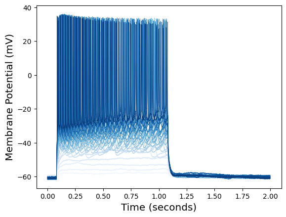
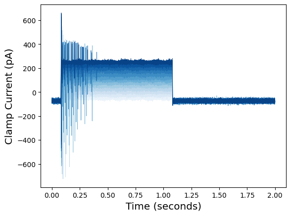
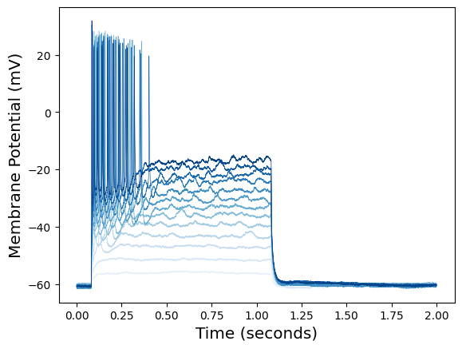
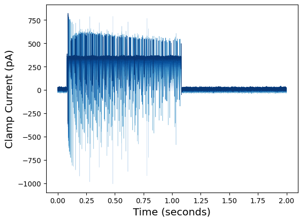
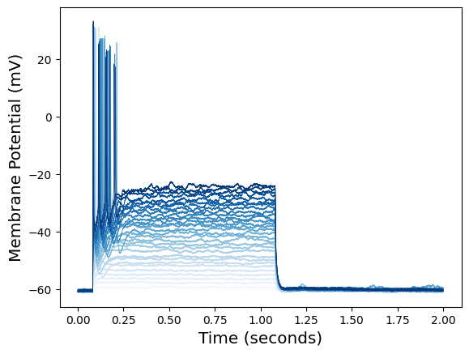
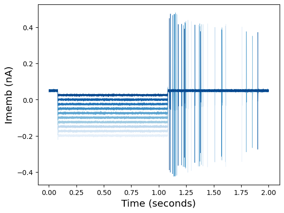
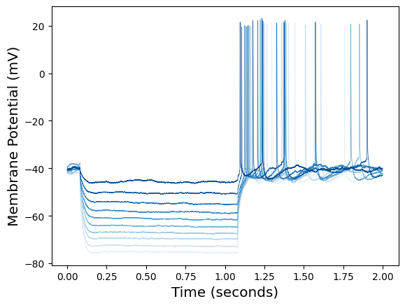

# Dataset: Ferguson et al. 2015

Data set of CA1 pyramidal cell recordings using an intact whole hippocampus preparation, including recordings of rebound firing.

Source of data: https://www.zenodo.org/record/17794#.W5j7lBQnYYM

Example: https://github.com/OpenSourceBrain/NWBShowcase/blob/master/FergusonEtAl2015/TestData.ipynb

The script [build.py](https://github.com/vrhaynes/NWBShowcase/blob/master/FergusonEtAl2015/build.py) generates all converted NWB format files from original ABF format files. [TestData.ipynb](https://github.com/vrhaynes/NWBShowcase/blob/master/FergusonEtAl2015/TestData.ipynb) is the primary Jupyter Notebook outlining necessary PyNWB elements for conversion. 

## Overview of data sets

### 1) Pyramidal cell 1 (PYR1.abf)

### 2) Pyramidal cell 2 (PYR2.abf)

### 3) Pyramidal cell 3 (PYR3.abf)

### 4) Pyramidal cell 4 (PYR4.abf)

### 5) Pyramidal cell 5 with rebound firing (PYR5_rebound.abf)

