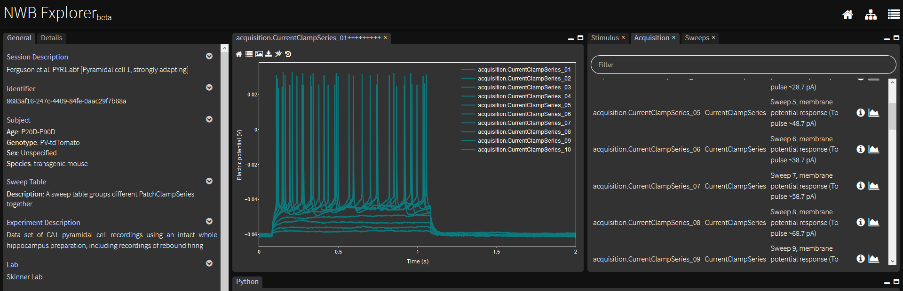
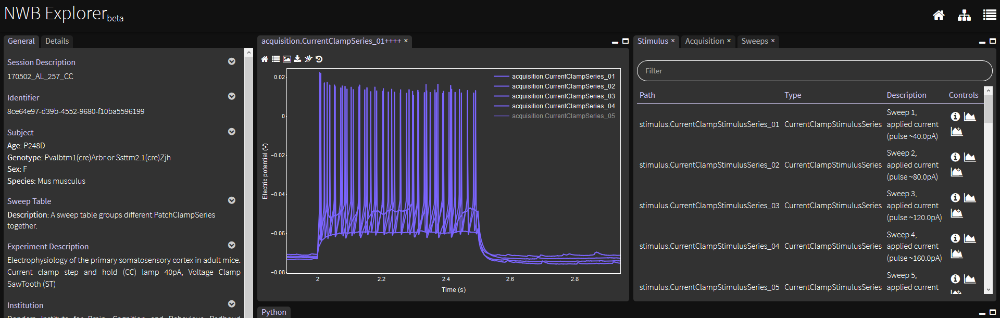
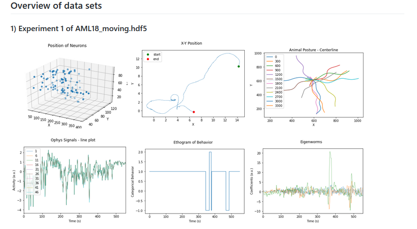

# Google Summer of Code 2020

## OSB: Conversion of public neurophysiology datasets to NeuroData Without Borders format

### Student Developer: Vergil Haynes
### Mentors: Padraig Gleeson, Matteo Cantarelli
### Organization: INCF

#### Description
Neuroscience data comes in multiple different data formats and structures. These differences provide a major technical barrier to sharing data between labs or even within labs. Often the organization and naming conventions of neuroscience data structures further obscures how to understand and analyze the data unless already intimately familiar with a specific data structure. The Neurodata Without Borders (NWB) Initiative provides neurophysiology datasets in a standardized HDF5 format that employs domain knowledge to alleviate the burden of different data formats and structures across multiple experimental paradigms. In addition, the NWB Initiative provides tools for handling, visualizing and analyzing NWB formatted data. This proposed project aims to contribute to NWB Showcase made available at NWB Explorer on the Open Source Brain repository. The proposed project will deliver multiple converted datasets to be viewed at the NWB Explorer and will integrate tutorials and analysis examples for select converted datasets.

### 1) Conversion of Ferguson datasets

Conversion scripts can be found [here](https://github.com/vrhaynes/NWBShowcase/tree/master/FergusonEtAl2015).

The Notebook [TestData.ipynb](https://github.com/vrhaynes/NWBShowcase/blob/master/FergusonEtAl2015/TestData.ipynb) illustrates the basic NWB elements of converting ABF formatted data to NWB. 

Conversion of a single dataset can be handled manual via the Notebook or all included datasets can be converted using running the following: 

    python build.py
    
For easy visualization of the NWB files, the Notebook [TestJWidgets.ipynb](https://github.com/vrhaynes/NWBShowcase/blob/master/FergusonEtAl2015/TestJWidgets.ipynb) can be used to explore the different NWB components.

### 2) Conversion of Lantyer datasets

Conversion scripts can be found [here](https://github.com/vrhaynes/NWBShowcase/tree/master/Lantyer).

The Notebook [TestData.ipynb](https://github.com/vrhaynes/NWBShowcase/blob/master/Lantyer/TestData.ipynb) illustrates the basic NWB elements of converting MAT formatted data to NWB. 

Conversion of a single dataset can be handled manual via the Notebook or all included datasets can be converted using running the following: 

    python build.py
    
For easy visualization of the NWB files, the Notebook [TestJWidgets.ipynb](https://github.com/vrhaynes/NWBShowcase/blob/master/Lantyer/TestJWidgets.ipynb) can be used to explore the different NWB components.
 
Finally, the Notebook [ScrapeSubjectMetadata.ipynb](https://github.com/vrhaynes/NWBShowcase/blob/master/Lantyer/ScrapeSubjectMetadata.ipynb) can be used to scrape metadata from the host webpage for the datasets. Metadata are automatically included in the conversion script for these datasets.

The final NWB files exceeding GitHub's file size limit can be found [here](https://figshare.com/account/projects/87320/articles/12780425).

### 3) Conversion of Scholz datasets

Conversion scripts can be found [here](https://github.com/vrhaynes/NWBShowcase/tree/master/ScholzEtAl2019). Currently not viewable on NWB Explorer.

The Notebook [TestData.ipynb](https://github.com/vrhaynes/NWBShowcase/blob/master/ScholzEtAl2019/TestData.ipynb) illustrates the basic NWB elements of converting HDF5 formatted data to NWB. 

Conversion of a single dataset can be handled manual via the Notebook or all included datasets can be converted using running the following: 

    python build.py

For easy visualization of the NWB files, the Notebook [TestJWidgets.ipynb](https://github.com/vrhaynes/NWBShowcase/blob/master/ScholzEtAl2019/TestJWidgets.ipynb) can be used to explore the different NWB components.

Finally, the Notebook [TestExtensions.ipynb](https://github.com/vrhaynes/NWBShowcase/blob/master/ScholzEtAl2019/TestExtensions.ipynb) illustrates pyNWB functionality supporting creation of NWB extensions.  

All final NWB files exceeded GitHub's file size limit and can be found [here](https://figshare.com/account/projects/87320/articles/12895349).

### Commit History
See https://github.com/OpenSourceBrain/NWBShowcase/commits?author=vrhaynes
