## Summary of contents of NWB files from Kato et al. 2015
Whole brain calcium imaging data from from Kato et al. (2015). **Global Brain Dynamics Embed the Motor Command Sequence of Caenorhabditis elegans**. Cell, 163(3), 656–669. http://doi.org/10.1016/j.cell.2015.09.034

Data was shared originally in MATLAB format by the [Zimmer lab](https://www.imp.ac.at/groups/manuel-zimmer/) here: https://osf.io/2395t, and converted to [Neurodata Without Borders](http://nwb.org) format by the scripts [here](https://github.com/OpenSourceBrain/NWBShowcase/tree/master/KatoEtAl2015).
### NWB file: KatoEtAl2018.WT_Stim.0.nwb
View & analyse this NWB file in **NWB Explorer** <a href="http://nwbexplorer.opensourcebrain.org/hub/nwbfile=https://raw.githubusercontent.com/OpenSourceBrain/NWBShowcase/master/KatoEtAl2015/KatoEtAl2018.WT_Stim.0.nwb">here</a>!
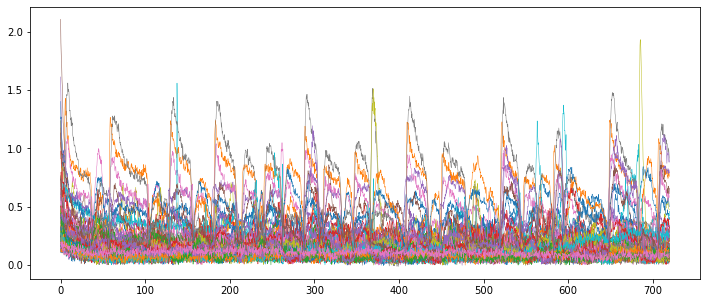
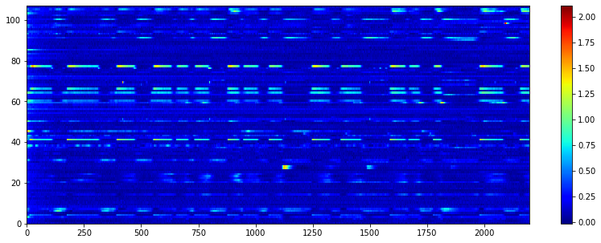
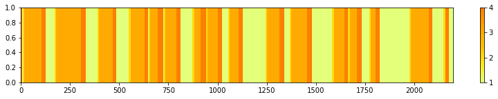
### NWB file: KatoEtAl2018.WT_Stim.1.nwb
View & analyse this NWB file in **NWB Explorer** <a href="http://nwbexplorer.opensourcebrain.org/hub/nwbfile=https://raw.githubusercontent.com/OpenSourceBrain/NWBShowcase/master/KatoEtAl2015/KatoEtAl2018.WT_Stim.1.nwb">here</a>!
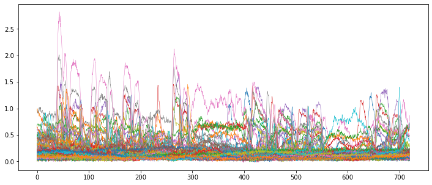
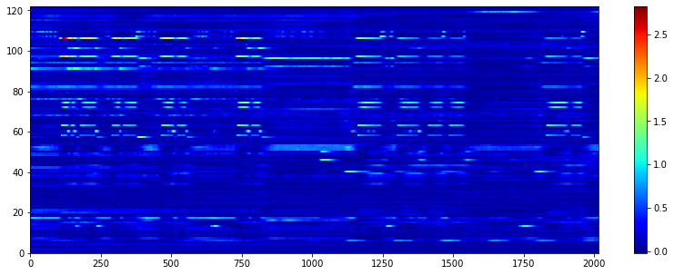
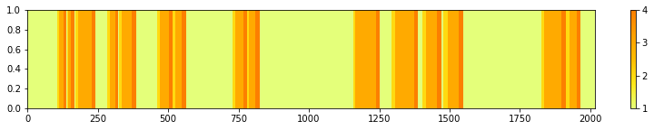
### NWB file: KatoEtAl2018.WT_Stim.2.nwb
View & analyse this NWB file in **NWB Explorer** <a href="http://nwbexplorer.opensourcebrain.org/hub/nwbfile=https://raw.githubusercontent.com/OpenSourceBrain/NWBShowcase/master/KatoEtAl2015/KatoEtAl2018.WT_Stim.2.nwb">here</a>!
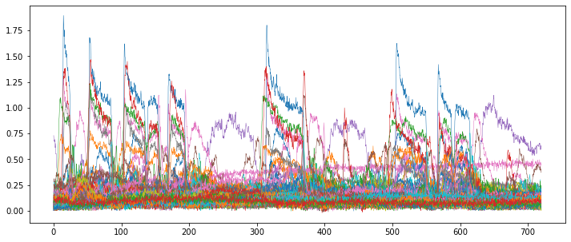
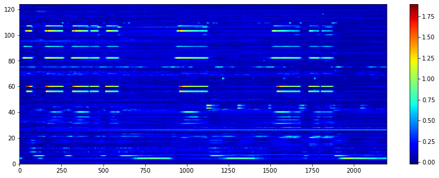
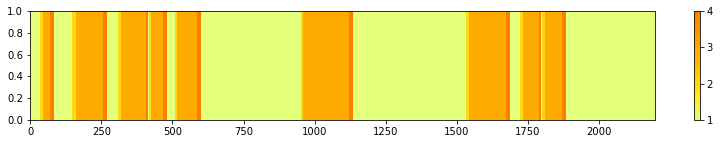
### NWB file: KatoEtAl2018.WT_Stim.3.nwb
View & analyse this NWB file in **NWB Explorer** <a href="http://nwbexplorer.opensourcebrain.org/hub/nwbfile=https://raw.githubusercontent.com/OpenSourceBrain/NWBShowcase/master/KatoEtAl2015/KatoEtAl2018.WT_Stim.3.nwb">here</a>!
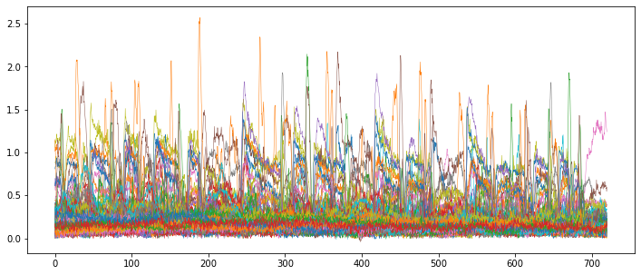
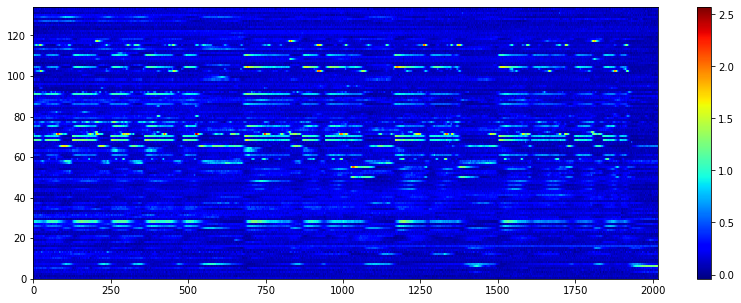
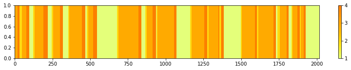
### NWB file: KatoEtAl2018.WT_Stim.4.nwb
View & analyse this NWB file in **NWB Explorer** <a href="http://nwbexplorer.opensourcebrain.org/hub/nwbfile=https://raw.githubusercontent.com/OpenSourceBrain/NWBShowcase/master/KatoEtAl2015/KatoEtAl2018.WT_Stim.4.nwb">here</a>!
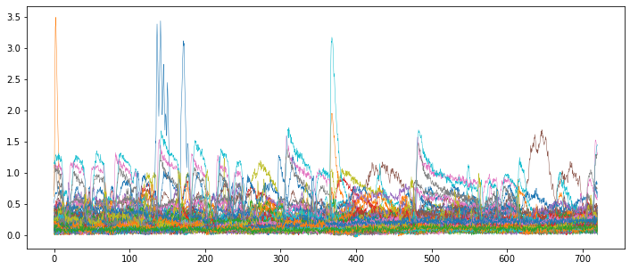
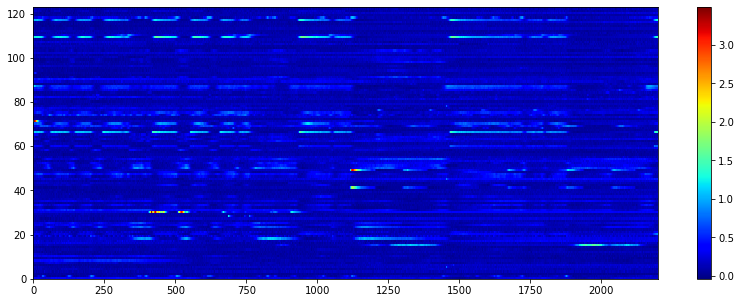
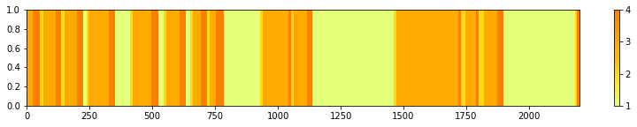
### NWB file: KatoEtAl2018.WT_Stim.5.nwb
View & analyse this NWB file in **NWB Explorer** <a href="http://nwbexplorer.opensourcebrain.org/hub/nwbfile=https://raw.githubusercontent.com/OpenSourceBrain/NWBShowcase/master/KatoEtAl2015/KatoEtAl2018.WT_Stim.5.nwb">here</a>!
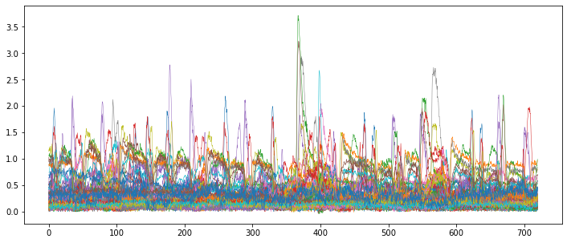
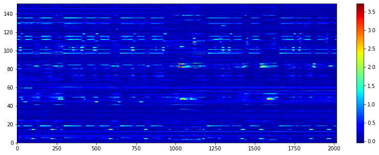
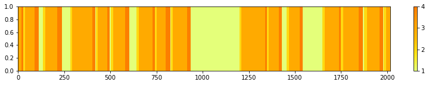
### NWB file: KatoEtAl2018.WT_Stim.6.nwb
View & analyse this NWB file in **NWB Explorer** <a href="http://nwbexplorer.opensourcebrain.org/hub/nwbfile=https://raw.githubusercontent.com/OpenSourceBrain/NWBShowcase/master/KatoEtAl2015/KatoEtAl2018.WT_Stim.6.nwb">here</a>!
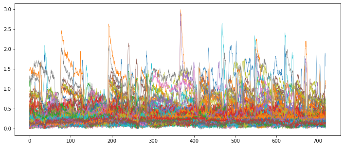
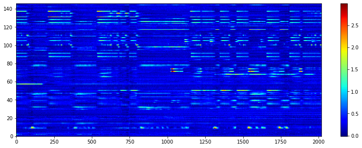
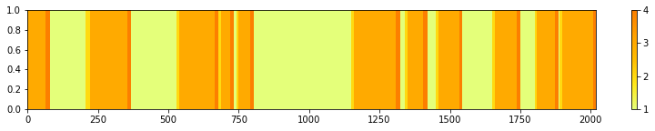
### NWB file: KatoEtAl2018.WT_NoStim.0.nwb
View & analyse this NWB file in **NWB Explorer** <a href="http://nwbexplorer.opensourcebrain.org/hub/nwbfile=https://raw.githubusercontent.com/OpenSourceBrain/NWBShowcase/master/KatoEtAl2015/KatoEtAl2018.WT_NoStim.0.nwb">here</a>!
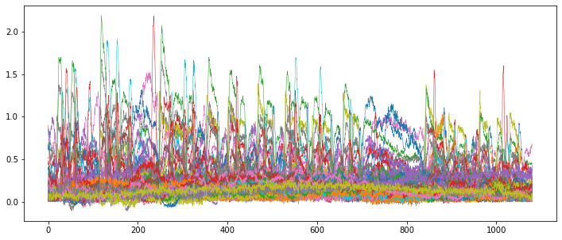
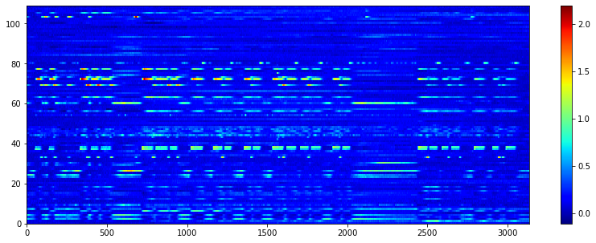
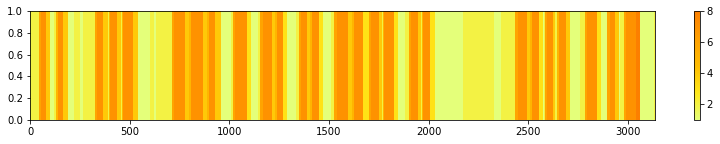
### NWB file: KatoEtAl2018.WT_NoStim.1.nwb
View & analyse this NWB file in **NWB Explorer** <a href="http://nwbexplorer.opensourcebrain.org/hub/nwbfile=https://raw.githubusercontent.com/OpenSourceBrain/NWBShowcase/master/KatoEtAl2015/KatoEtAl2018.WT_NoStim.1.nwb">here</a>!
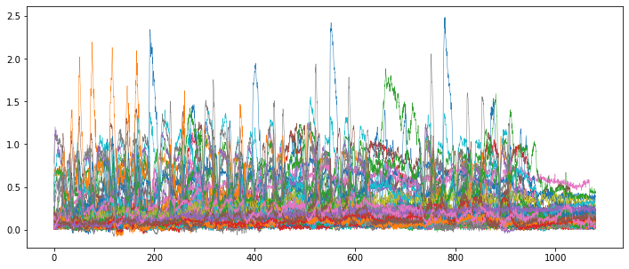
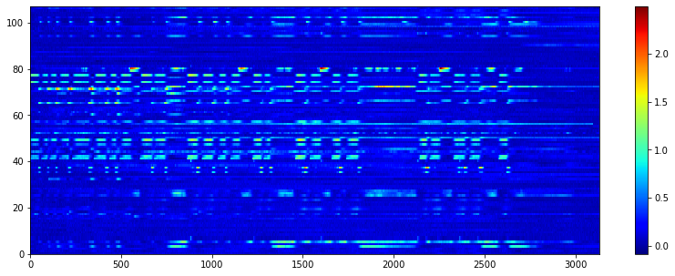
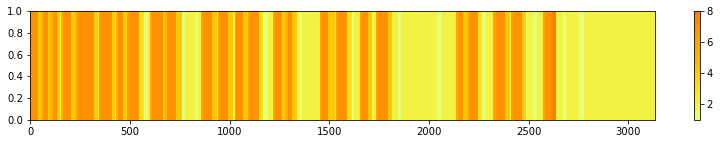
### NWB file: KatoEtAl2018.WT_NoStim.2.nwb
View & analyse this NWB file in **NWB Explorer** <a href="http://nwbexplorer.opensourcebrain.org/hub/nwbfile=https://raw.githubusercontent.com/OpenSourceBrain/NWBShowcase/master/KatoEtAl2015/KatoEtAl2018.WT_NoStim.2.nwb">here</a>!
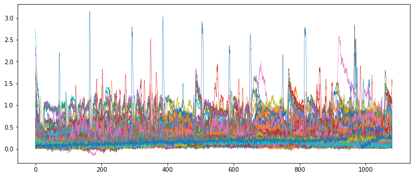
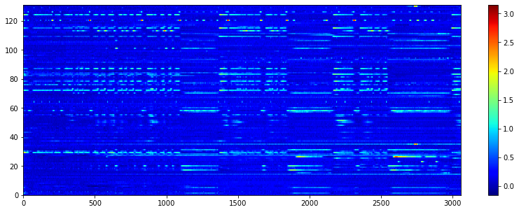
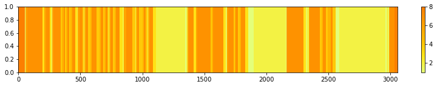
### NWB file: KatoEtAl2018.WT_NoStim.3.nwb
View & analyse this NWB file in **NWB Explorer** <a href="http://nwbexplorer.opensourcebrain.org/hub/nwbfile=https://raw.githubusercontent.com/OpenSourceBrain/NWBShowcase/master/KatoEtAl2015/KatoEtAl2018.WT_NoStim.3.nwb">here</a>!
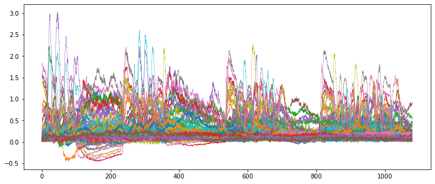
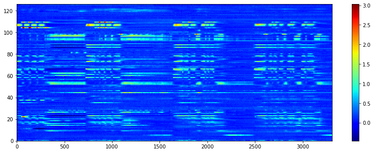
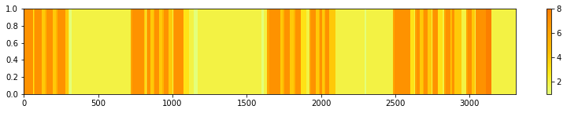
### NWB file: KatoEtAl2018.WT_NoStim.4.nwb
View & analyse this NWB file in **NWB Explorer** <a href="http://nwbexplorer.opensourcebrain.org/hub/nwbfile=https://raw.githubusercontent.com/OpenSourceBrain/NWBShowcase/master/KatoEtAl2015/KatoEtAl2018.WT_NoStim.4.nwb">here</a>!
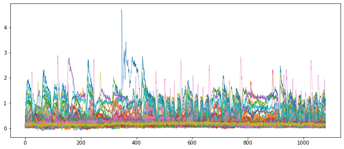

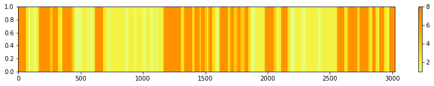
### NWB file: KatoEtAl2018.AVA_HisCl.0.nwb
View & analyse this NWB file in **NWB Explorer** <a href="http://nwbexplorer.opensourcebrain.org/hub/nwbfile=https://raw.githubusercontent.com/OpenSourceBrain/NWBShowcase/master/KatoEtAl2015/KatoEtAl2018.AVA_HisCl.0.nwb">here</a>!
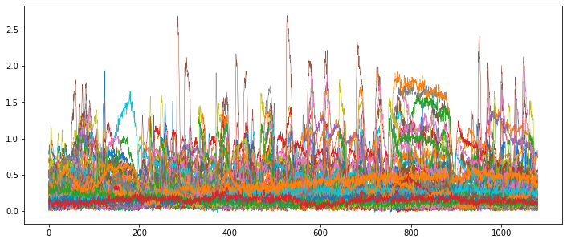
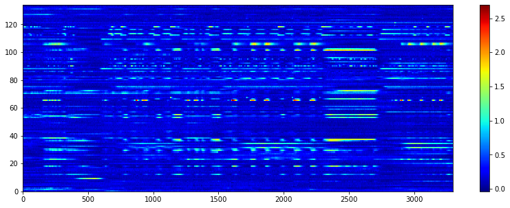
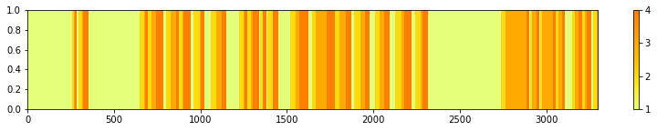
### NWB file: KatoEtAl2018.AVA_HisCl.1.nwb
View & analyse this NWB file in **NWB Explorer** <a href="http://nwbexplorer.opensourcebrain.org/hub/nwbfile=https://raw.githubusercontent.com/OpenSourceBrain/NWBShowcase/master/KatoEtAl2015/KatoEtAl2018.AVA_HisCl.1.nwb">here</a>!
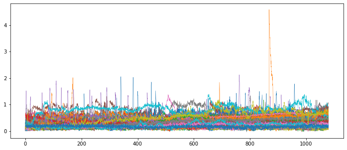
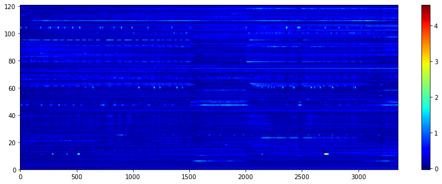
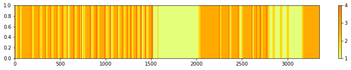
### NWB file: KatoEtAl2018.AVA_HisCl.2.nwb
View & analyse this NWB file in **NWB Explorer** <a href="http://nwbexplorer.opensourcebrain.org/hub/nwbfile=https://raw.githubusercontent.com/OpenSourceBrain/NWBShowcase/master/KatoEtAl2015/KatoEtAl2018.AVA_HisCl.2.nwb">here</a>!
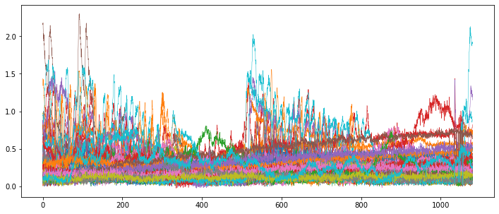
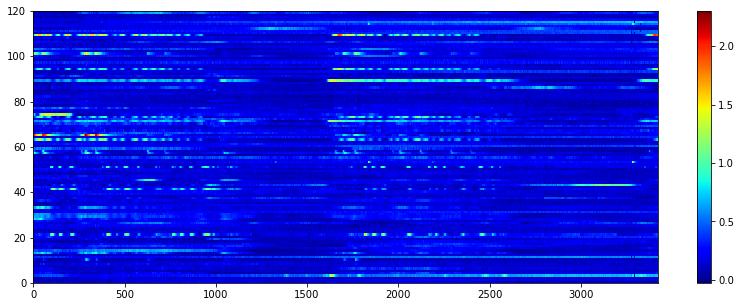
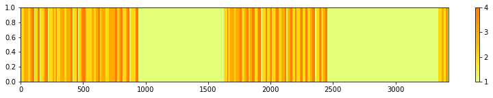
### NWB file: KatoEtAl2018.AVA_HisCl.3.nwb
View & analyse this NWB file in **NWB Explorer** <a href="http://nwbexplorer.opensourcebrain.org/hub/nwbfile=https://raw.githubusercontent.com/OpenSourceBrain/NWBShowcase/master/KatoEtAl2015/KatoEtAl2018.AVA_HisCl.3.nwb">here</a>!
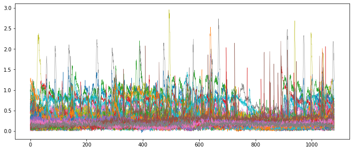
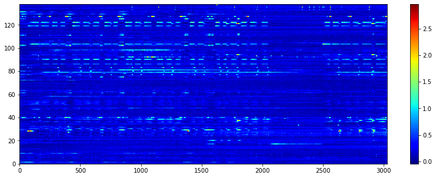

### NWB file: KatoEtAl2018.AVA_HisCl.4.nwb
View & analyse this NWB file in **NWB Explorer** <a href="http://nwbexplorer.opensourcebrain.org/hub/nwbfile=https://raw.githubusercontent.com/OpenSourceBrain/NWBShowcase/master/KatoEtAl2015/KatoEtAl2018.AVA_HisCl.4.nwb">here</a>!

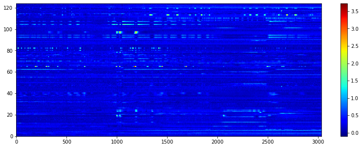
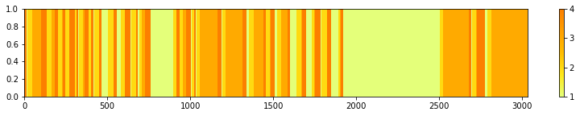
