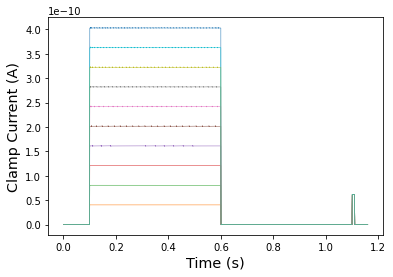
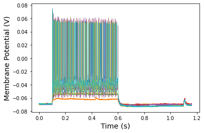

## Databank for intracellular electrophysiological mapping of the adult somatosensory cortex 

Lantyer Ad; Calcini N; Bijlsma A; Kole K; Emmelkamp M; Peeters M; Scheenen WJJ; Zeldenrust F; Celikel T (2018): 
Supporting data for "A databank for intracellular electrophysiological mapping of the adult somatosensory cortex" 
GigaScience Database. http://dx.doi.org/10.5524/100535

Source of data: http://gigadb.org/dataset/view/id/100535

The script [build.py](https://github.com/vrhaynes/NWBShowcase/blob/master/Lantyer/build.py) generates all converted NWB format files from original MAT format files. [TestData.ipynb](https://github.com/vrhaynes/NWBShowcase/blob/master/Lanter/TestData.ipynb) is the primary Jupyter Notebook outlining necessary PyNWB elements for conversion. 

## Overview of data sets

### 1) Current Clamp 1 (180817_ME_9_CC.mat)

### 2) Current Clamp 2 (170502_AL_257_CC.mat)

### 3) Voltage Clamp 1 (170328_AL_238_VC.mat)

### 4) Voltage Clamp 2 (170315_AL_216_VCC.mat)

### 5) Voltage Clamp - Sawtooth 1 (171220_NC_156_ST100_C.mat)

### 6) Voltage Clamp - Sawtooth 2 (170328_AB_277_ST50_C.mat)

