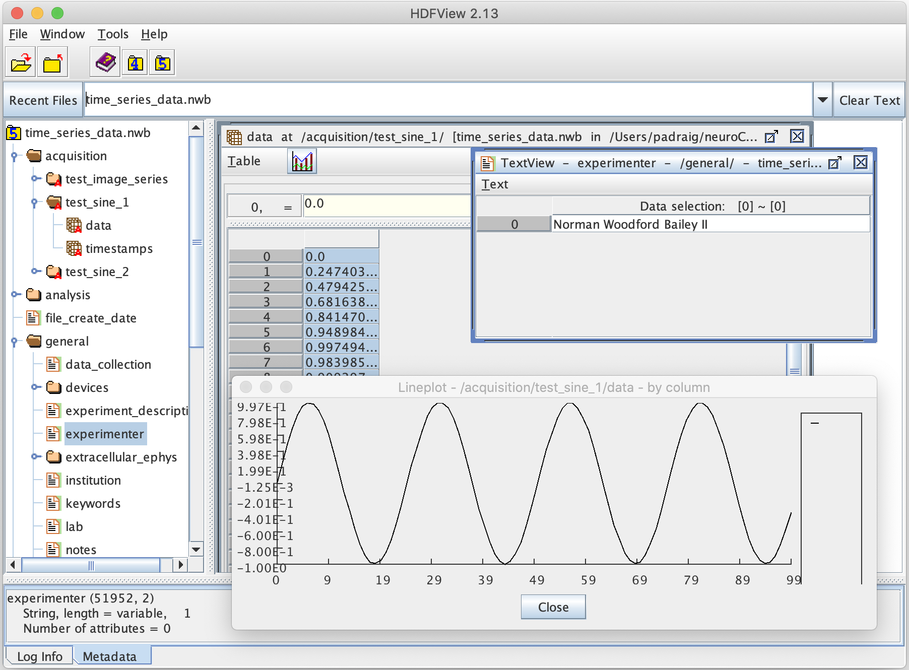
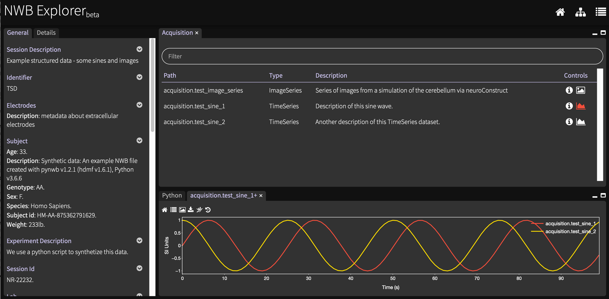
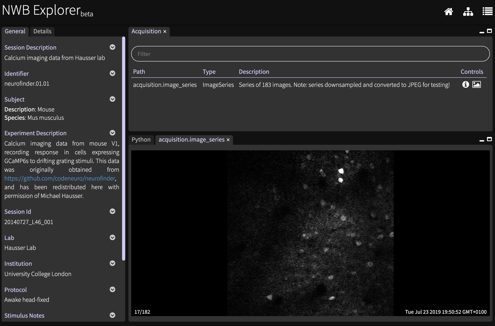

# NWB Showcase

Open Source Brain Showcase project containing examples of [Neurodata Without Borders (NWB)](https://www.nwb.org/) data. OSB is developing the infrastructure to visualise and analyse experimental data which has been shared publicly in NWB format.

This repository will contain **some example datasets** which we will convert to NWB to test this functionality. 

The target format will be NWB v2.0 and we intend to make use of [PyNWB](https://github.com/NeurodataWithoutBorders/pynwb) for reading/writing the NWB files.

## 1) Simple scripts to generate NWB using PyNWB

The script [simple.py](https://github.com/OpenSourceBrain/NWBShowcase/blob/master/NWB/simple.py) illustrates a minimal Python script necessary to generate [a valid NWB file](https://github.com/OpenSourceBrain/NWBShowcase/blob/master/NWB/simple_example.nwb).

To run this, [install PyNWB](https://pynwb.readthedocs.io/en/stable/getting_started.html#installation) and run:

    python simple.py

It will produce a file [simple_example.nwb](https://github.com/OpenSourceBrain/NWBShowcase/blob/master/NWB/simple_example.nwb) in HDF5 format. 
To view the contents of this file (or any file in HDF5) you can use [HDFView](https://portal.hdfgroup.org/display/HDFVIEW/HDFView). 
However, this NWB file doesn't have any real data in it yet. The script [time_series_data.py](https://github.com/OpenSourceBrain/NWBShowcase/blob/master/NWB/time_series_data.py) will add some simple time series traces (sine waves) and a set of images to the NWB file to provide some example data

    python time_series_data.py

The [generated file](https://github.com/OpenSourceBrain/NWBShowcase/blob/master/NWB/time_series_data.nwb) can be loaded into [HDFView](https://portal.hdfgroup.org/display/HDFVIEW/HDFView) and the structure of groups/datasets for NWB explored. Navigating to **/acquisition/test_sine_1/data**, opening the dataset, and then generating a Line Plot from it results in:

Other information located in the NWB file about the experiment (e.g. at **/general/experimenter**) can also be viewed.

However, HDFViewer doesn't treat NWB files differently from any other HDF5 file, and there are no special provisions for the types of data and metadat present in such files.

[NWB Explorer](http://nwbexplorer.opensourcebrain.org) on the other hand does know about the structure of NWB data files, and presents this in an easily accessible way. Go to http://nwbexplorer.opensourcebrain.org and click on "Simple time series":

## 2) Converting electrophysiology data to NWB using PyNWB

The scripts in [this directory](https://github.com/OpenSourceBrain/NWBShowcase/tree/master/FergusonEtAl2015) convert data which has been shared in **Axon Binary Format (ABF)** to NWB.

See [this Jupyter notebook](https://github.com/OpenSourceBrain/NWBShowcase/blob/master/FergusonEtAl2015/TestData.ipynb) for the details of the conversion.

The resultant NWB files (e.g. [this](https://github.com/OpenSourceBrain/NWBShowcase/blob/master/FergusonEtAl2015/FergusonEtAl2015.nwb)) can be viewed with [NWB Explorer](http://nwbexplorer.opensourcebrain.org) by pressing one of the links labelled **Ferguson et al. 2015**:

 

## 3) Converting MATLAB data to NWB using PyNWB

An example of converting data in MATLAB format into NWB can be found [here](https://github.com/OpenSourceBrain/NWBShowcase/blob/master/Lantyer/TestData.ipynb).

This data can be viewed with [NWB Explorer](http://nwbexplorer.opensourcebrain.org) by pressing **Lantyer et al. 2018**.

## 4) Converting Igor Pro data to NWB using PyNWB

An example of converting data in Igor Pro format into NWB can be found [here](https://github.com/OpenSourceBrain/NWBShowcase/blob/master/IgorPro/Parse.py).

This data can be viewed with [NWB Explorer](http://nwbexplorer.opensourcebrain.org) by pressing **Lanore et al. 2019**.

## 5) Converting imaging data to NWB using PyNWB

An example of converting imaging data into NWB can be found [here](https://github.com/OpenSourceBrain/CalciumImagingDriftingGrating).

This data can be viewed with [NWB Explorer](http://nwbexplorer.opensourcebrain.org) by pressing **Packer et al. 2015**.

## 6) More datasets to convert

There are a list of potentially interesting datasets [here](https://github.com/OpenSourceBrain/NWBShowcase/issues) containing publicly available experimental data which could be converted to NWB format. Suggestions welcome!!

