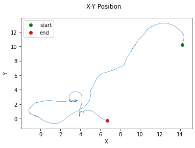

## Whole-brain neural recordings of freely moving C. elegans

Scholz, Monika. 2019. “Whole-Brain Neural Recordings of Freely Moving C. Elegans.” OSF. March 8. doi:10.17605/OSF.IO/MW5ZS. 

Source of data: https://osf.io/mw5zs/

The script [build.py](https://github.com/vrhaynes/NWBShowcase/blob/master/ScholzEtAl2019/build.py) generates all converted NWB format files from original MAT format files. [TestData.ipynb](https://github.com/vrhaynes/NWBShowcase/blob/master/ScholzEtAl2019/TestData.ipynb) is the primary Jupyter Notebook outlining necessary PyNWB elements for conversion. 

## Overview of data sets

### 1) Experiment 1 of AML18_moving.hdf5

  
   
  

  
   
  

